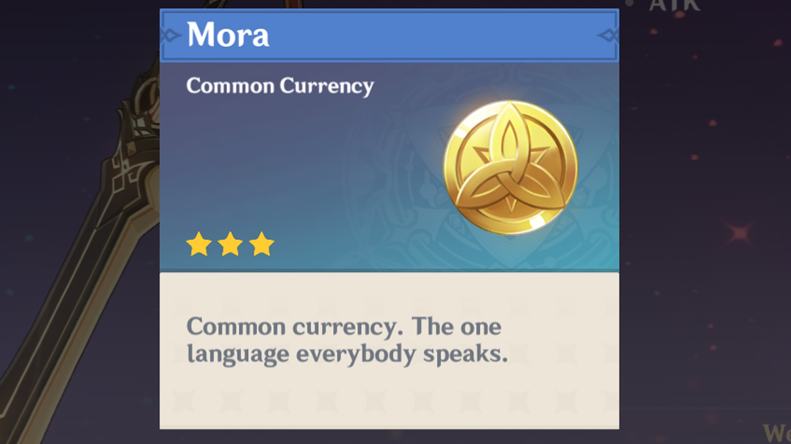

## Genshin for Noobs 101

Hey Traveler, so you some how have gotten addicted to Genshim Impact with its gReaT wishing system and AmaZiNg artifact rolls...but are left with absolutely zero patience and on the brink of uninstalling the game? Fear no more, in this page you'll learn how to be resourceful and increase your accounts worth!

My name is Dest, and I am a junior at John Glenn Highschool. I've played Genshin since September of 2020 and have been there, quite too literally. I know what it is like to feel frustrated with making no progress and having low skill and low mora (Genshin currency). So, I'll do my best to explain some simple tips and tricks. 

*Note: This game can be played however the player chooses to play it, so theoretically there is not right or wrong way to play Genshin Impact.*


### Thee Basics About Currency

I will be guessing that you know some simple knowledge about the currency names in the game since you're here. Do not fret though, I will be explaining them with some terminology connected to the game.

## What To Do and What Not To Do With Mora



While it might be tempting to spend on items in the beginning of the game...DO NOT..instead
- Save up your Mora to upgrade **talent levels**
 of your character; the higher the level the more outrageously costly.
- Mora can be used for ingredients which also allows you to cook meals that can heal your characters during several battles.
- Raising the level of your weapons, increases the damage you do on opponents.
- Raising artifacts **POTENTIALLY** increases overall damage on a wider scale.

## The Importance of Resin

![original resin image] 

First off, what is Resin right? So basically, resin is used to claim certain rewards and can be used for Abyssal Domains, Ley Line Blossoms, bosses, adventure rank and more.
     Can these items be ranked from most important to least important? Short and simple answer: yes...however 


1. Numbered
2. List

**Bold** and _Italic_ and `Code` text

[Link](url) and 
```

For more details see [Basic writing and formatting syntax](https://docs.github.com/en/github/writing-on-github/getting-started-with-writing-and-formatting-on-github/basic-writing-and-formatting-syntax).

### Jekyll Themes

Your Pages site will use the layout and styles from the Jekyll theme you have selected in your [repository settings](https://github.com/destz/destz.github.io/settings/pages). The name of this theme is saved in the Jekyll `_config.yml` configuration file.

### Support or Contact

Having trouble with Pages? Check out our [documentation](https://docs.github.com/categories/github-pages-basics/) or [contact support](https://support.github.com/contact) and we’ll help you sort it out.
