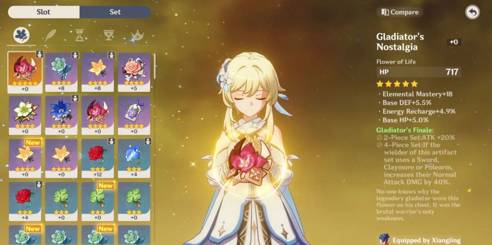

## Genshin for Noobs 101

Hey Traveler, so you some how have gotten addicted to Genshim Impact with its gReaT wishing system and AmaZiNg artifact rolls...but are left with absolutely zero patience and on the brink of uninstalling the game? Fear no more, in this page you'll learn how to be resourceful and increase your accounts worth!

My name is Dest, and I am a junior at John Glenn Highschool. I've played genshin since September of 2020 and have been there, quite to literally. I know what it is like to feel frusterated with making no progress and having low skill and low mora (Genshin currency). So, I'll do my best to explain some simple tips and tricks. 

## Test image


### Markdown

Markdown is a lightweight and easy-to-use syntax for styling your writing. It includes conventions for

```markdown
Syntax highlighted code block

# Header 1
## Header 2
### Header 3

- Bulleted
- List

1. Numbered
2. List

**Bold** and _Italic_ and `Code` text

[Link](url) and 
```

For more details see [Basic writing and formatting syntax](https://docs.github.com/en/github/writing-on-github/getting-started-with-writing-and-formatting-on-github/basic-writing-and-formatting-syntax).

### Jekyll Themes

Your Pages site will use the layout and styles from the Jekyll theme you have selected in your [repository settings](https://github.com/destz/destz.github.io/settings/pages). The name of this theme is saved in the Jekyll `_config.yml` configuration file.

### Support or Contact

Having trouble with Pages? Check out our [documentation](https://docs.github.com/categories/github-pages-basics/) or [contact support](https://support.github.com/contact) and we’ll help you sort it out.
